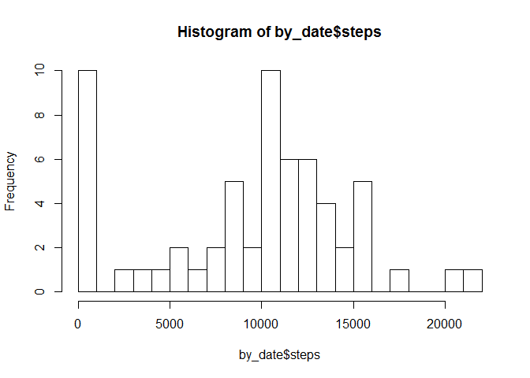
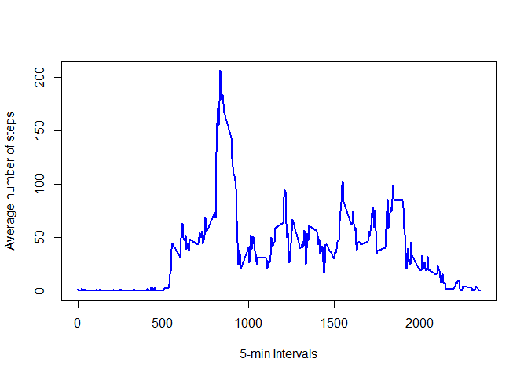
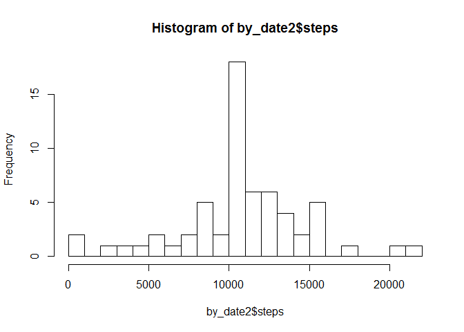
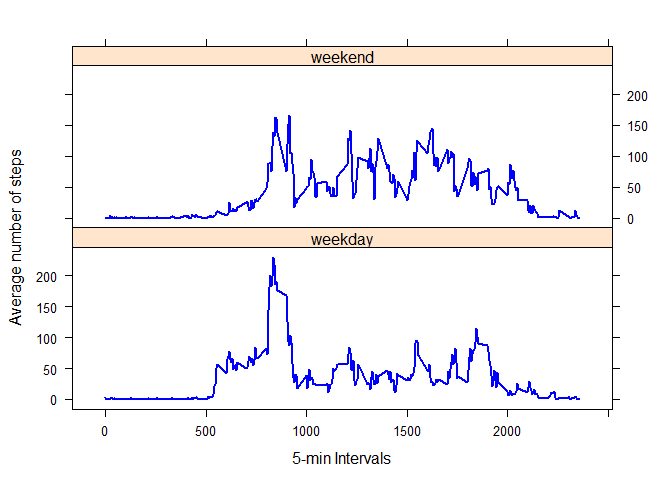

# Reproducible Research: Peer Assessment 1
August 12, 2016  


## Loading and preprocessing the data


```r
unzip("activity.zip")
data <- read.csv("activity.csv", na.strings = "NA", header = TRUE)

data <- tbl_df(data)
data$date <- as.Date(data$date)
```


## What is mean total number of steps taken per day?

```r
by_date <- data[,1:2] %>%
    group_by(date) %>%
    summarise_each(funs(sum(., na.rm = TRUE)))

hist(by_date$steps, breaks = 20)
```

<!-- -->

```r
mean_steps <- mean(by_date$steps)
median_steps <- median(by_date$steps)

cat("Mean steps: ", mean_steps)
```

```
## Mean steps:  9354.23
```

```r
cat("Median steps: ", median_steps)
```

```
## Median steps:  10395
```

## What is the average daily activity pattern?


```r
by_interval <- data[, c(1,3)] %>%
    group_by(interval) %>%
    summarise_each(funs(mean(., na.rm = TRUE)))

plot(by_interval$interval, by_interval$steps, type="l", xlab= "5-min Intervals", ylab= "Average number of steps", col="blue", lwd=2)
```

<!-- -->

```r
max_interval <- which.max( by_interval$steps)

cat("Interal with maximum average steps: ", max_interval)
```

```
## Interal with maximum average steps:  104
```

```r
cat("Time with maximum average steps: ", by_interval[[max_interval, 1]])
```

```
## Time with maximum average steps:  835
```
## Imputing missing values


```r
num_missing_rows <- sum(is.na(data[,1]) | is.na(data[,2]))
cat("Number of missing rows: ", num_missing_rows)
```

```
## Number of missing rows:  2304
```

```r
na_idx <- which(is.na(data[,1]) | is.na(data[,2]))
na_intervals <- data[na_idx,3]

filled_data <- data
for (i in 1:length(na_idx))
{
    filled_data[na_idx[i],1][[1]] <- by_interval[by_interval$interval == na_intervals$interval[i], 2][[1]] 
}

by_date2 <- filled_data %>%
    group_by(date) %>%
    summarise_each(funs(sum))

hist(by_date2$steps, breaks = 20)
```

<!-- -->

```r
mean_steps2 <-mean(by_date2$steps)
median_steps2 <-median(by_date2$steps)
```
The mean and median steps in the new data set are 1.0766189\times 10^{4} and 1.0766189\times 10^{4}, respectively.

## Are there differences in activity patterns between weekdays and weekends?

```r
filled_data <- mutate(filled_data, day = weekdays(filled_data$date))
weekdays <- filled_data$day %in% c("Monday", "Tuesday","Wednesday", "Thursday", "Friday")
weekends <- filled_data$day %in% c("Saturday", "Sunday")
filled_data$day[weekdays] <- "weekday"
filled_data$day[weekends] <- "weekend"
filled_data$day <- as.factor(filled_data$day)
```

The average number of steps during weekdays and weekends are calculated as follows:


```r
by_day <- group_by(filled_data, day, interval)
by_day <- summarise_each(by_day, funs(mean))

weekdays_idx <- which(by_day$day == "weekday")
weekends_idx <- which(by_day$day == "weekend")

xyplot(steps ~interval | day, data=by_day,  type="l", xlab= "5-min Intervals", ylab= "Average number of steps", col="blue", lwd=2, layout =c(1,2))
```

<!-- -->
